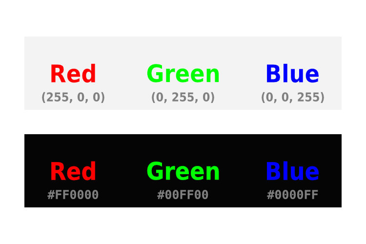
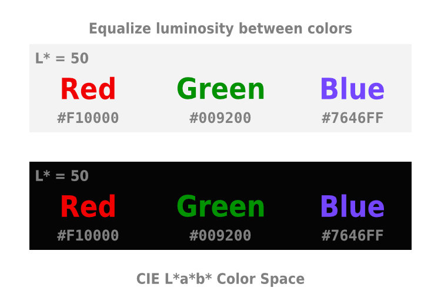
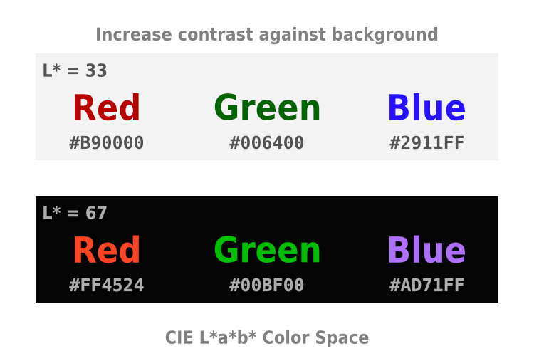
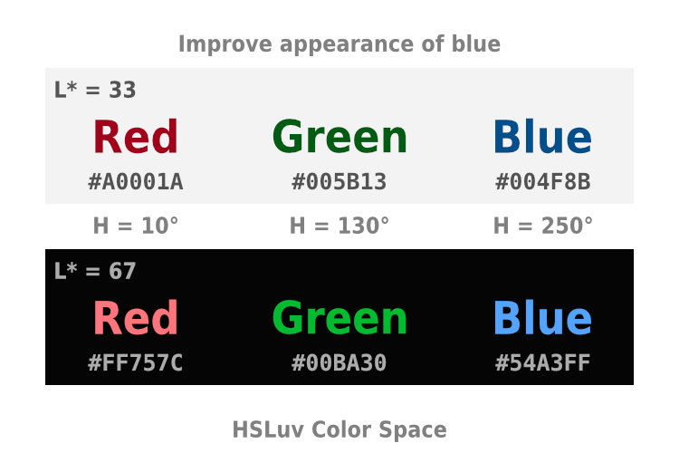
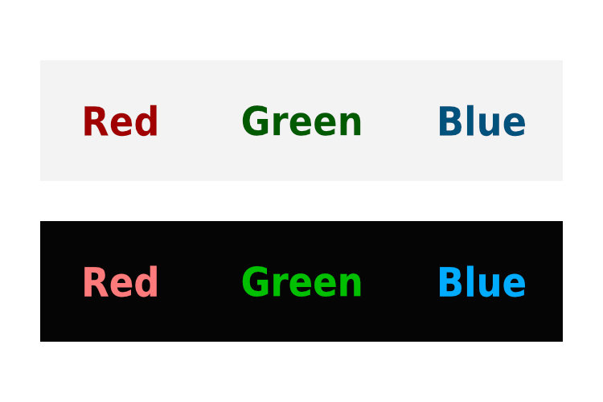
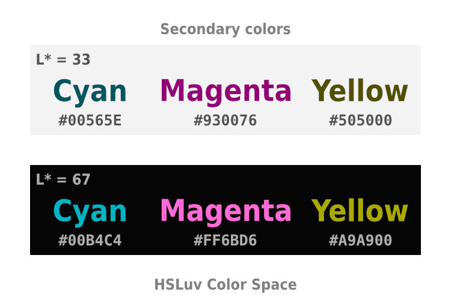
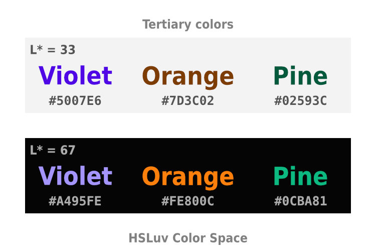

# Perceptually uniform color spaces

Short presentation to be given by Will Henney at DAWGI, Morelia meeting 2023-04-24

## Summary

Suppose we want to write some red, green, and blue text. We want the red, green and blue to be equally bright, so that the text is easy to read. I will show why this is difficult to do in the RGB color space, and how perceptually uniform color spaces, such as CIE L\*a\*b\* and HSLuv can help. 

## Resumen

Supongamos que queremos escribir un texto rojo, verde, y azul. Queremos que el rojo, el verde y el azul tengan el mismo brillo, para que el texto sea fácil de leer. Mostraré por qué esto es difícil de hacer en el espacio de color RGB, y cómo los espacios de color perceptualmente uniformes, como CIE L\*a\*b\* y HSLuv, pueden ayudar.

## Links

* [RGB wikipedia page](https://en.wikipedia.org/wiki/RGB_color_space)
* [Color model wikipedia page](https://en.wikipedia.org/wiki/Color_model)
* [Spectral sensitivity wikipedia page](https://en.wikipedia.org/wiki/Spectral_sensitivity)
* [Wavelength sensitivity of cones (U. Toronto)](https://www.physics.utoronto.ca/~jharlow/cones.html)
* [CIELab wikipedia page](https://en.wikipedia.org/wiki/CIELAB_color_space)
* [HSLuv online visual conversion tool](https://www.hsluv.org/)
* [CIELuv wikipedia page](https://en.wikipedia.org/wiki/CIELUV)

## Slides

