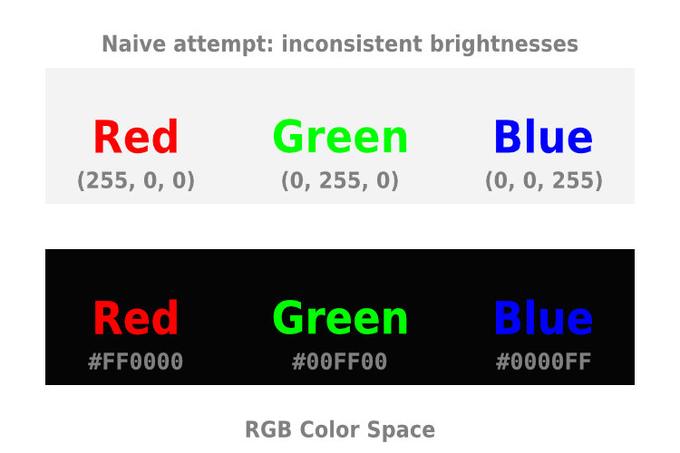
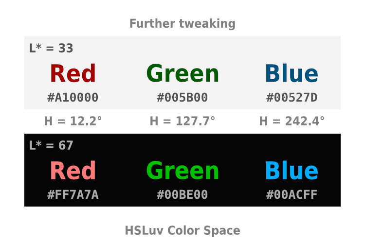
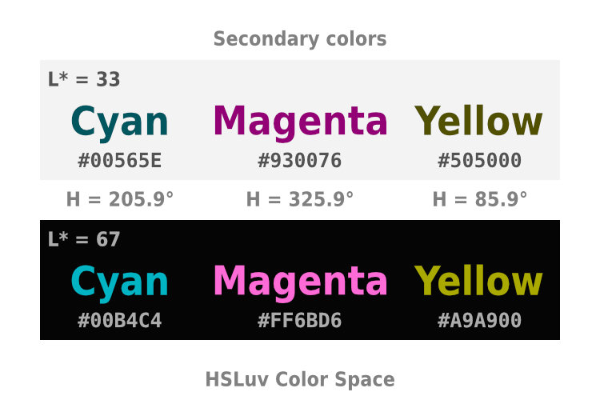

# Perceptually uniform color spaces

Short presentation to be given by Will Henney at DAWGI, Morelia meeting 2023-04-24

## Summary

Suppose we want to write some red, green, and blue text. We want the red, green and blue to be equally bright, so that the text is easy to read. I will show why this is difficult to do in the RGB color space, and how perceptually uniform color spaces, such as CIE L\*a\*b\* and HSLuv can help. 

## Resumen

Supongamos que queremos escribir un texto rojo, verde, y azul. Queremos que el rojo, el verde y el azul tengan el mismo brillo, para que el texto sea fácil de leer. Mostraré por qué esto es difícil de hacer en el espacio de color RGB, y cómo los espacios de color perceptualmente uniformes, como CIE L\*a\*b\* y HSLuv, pueden ayudar.

## Links

* [RGB wikipedia page](https://en.wikipedia.org/wiki/RGB_color_space)
* [Color model wikipedia page](https://en.wikipedia.org/wiki/Color_model)
* [Spectral sensitivity wikipedia page](https://en.wikipedia.org/wiki/Spectral_sensitivity)
* [Wavelength sensitivity of cones (U. Toronto)](https://www.physics.utoronto.ca/~jharlow/cones.html)
* [CIELab wikipedia page](https://en.wikipedia.org/wiki/CIELAB_color_space)
* [HSLuv online visual conversion tool](https://www.hsluv.org/)
* [CIELuv wikipedia page](https://en.wikipedia.org/wiki/CIELUV)

## Slides

We want to write some red, green, and blue text, and we want the red, green and blue to be equally bright, so that the text is easy to read. But this is difficult to do in the RGB color space.

Naively, we might try to max out the red, green and blue values, but this gives us a green that is very bright (hard to see on a bright background) and a blue that is very dark (hard to see on a dark background).

The reason for this is that the RGB color space is not perceptually uniform. This means that equal changes in the RGB values do not correspond to equal changes in the perceived brightness of the color. This is mainly due to the [spectral response of the three types of cone cells in the human eye](https://www.physics.utoronto.ca/~jharlow/cones.html). 

We can improve matters by using a perceptually uniform color space, such as CIE L\*a\*b\*. In this color space, equal changes in the L\* value correspond to equal changes in the perceived brightness of the color.

In this example, I have set the L\* value to 50 while keeping the a\* and b\* values at the same value as in the previous example. This gives us a red, green and blue that are equally bright, and therefore easy to read. 

We can also increase the contrast by using darker colors (L\* = 33) against the bright background, and brighter colors (L\* = 67) against the dark background.

BUT, the brighter blue looks a bit weird, more like purple. This is because the L\*a\*b\* color space is not perceptually uniform in the a\* and b\* directions.

We can try to improve matters by using a color space that has better uniformity in all three dimensions, such as those based on CIE Luv. I am using a cylindrical polar coordinate variant called HSLuv, which is particularly easy to work with and has a nice online visual conversion tool. In the HSLuv color space, H is the hue, which is given as an angle between 0 and 360 degrees, S is the saturation, which is given as a percentage between 0 and 100, and L is the lightness, which is given as a percentage between 0 and 100

In this example I have fixed the angle between the red, green and blue colors to 120 degrees, and I have set the saturation to 100%. 

We can get slightly better results by relaxing the requirement that the hues should be equally spaced. 
But at this point, we are getting diminishing returns. 

We can apply the idea to other triplets of colors. Here are the secondary colors, with hues rotated by 60 degrees from the primary colors. 

And here are some tertiary colors, with hues rotated by 30 degrees from the secondary colors.  The name Pine was suggested to me by chatGPT. It originally suggested Ocean Green, but I asked it for something shorter. 

